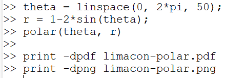
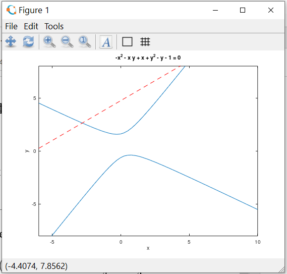

---
# Front matter
lang: ru-RU
title: "ОТЧЕТ ПО ЛАБОРАТОРНОЙ РАБОТЕ №7"
subtitle: "Графики"
author: "Аминов Зулфикор Мирзокаримович"

# Formatting
toc-title: "Содержание"
toc: true # Table of contents
toc_depth: 2
lof: true # List of figures
lot: true # List of tables
fontsize: 12pt
linestretch: 1.5
papersize: a4paper
documentclass: scrreprt
polyglossia-lang: russian
polyglossia-otherlangs: english
mainfont: PT Serif
romanfont: PT Serif
sansfont: PT Sans
monofont: PT Mono
mainfontoptions: Ligatures=TeX
romanfontoptions: Ligatures=TeX
sansfontoptions: Ligatures=TeX,Scale=MatchLowercase
monofontoptions: Scale=MatchLowercase
indent: true
pdf-engine: lualatex
header-includes:
  - \linepenalty=10 # the penalty added to the badness of each line within a paragraph (no associated penalty node) Increasing the value makes tex try to have fewer lines in the paragraph.
  - \interlinepenalty=0 # value of the penalty (node) added after each line of a paragraph.
  - \hyphenpenalty=50 # the penalty for line breaking at an automatically inserted hyphen
  - \exhyphenpenalty=50 # the penalty for line breaking at an explicit hyphen
  - \binoppenalty=700 # the penalty for breaking a line at a binary operator
  - \relpenalty=500 # the penalty for breaking a line at a relation
  - \clubpenalty=150 # extra penalty for breaking after first line of a paragraph
  - \widowpenalty=150 # extra penalty for breaking before last line of a paragraph
  - \displaywidowpenalty=50 # extra penalty for breaking before last line before a display math
  - \brokenpenalty=100 # extra penalty for page breaking after a hyphenated line
  - \predisplaypenalty=10000 # penalty for breaking before a display
  - \postdisplaypenalty=0 # penalty for breaking after a display
  - \floatingpenalty = 20000 # penalty for splitting an insertion (can only be split footnote in standard LaTeX)
  - \raggedbottom # or \flushbottom
  - \usepackage{float} # keep figures where there are in the text
  - \floatplacement{figure}{H} # keep figures where there are in the text
---

# Ход работы:

Включим журналирование

{ #fig:001 width=70% }

# Параметрические графики

Определим параметр t как вектор в этом диапазоне, затем мы вычислим x и y.

{ #fig:001 width=70% }
{ #fig:001 width=70% }

# Полярные координаты

Графики в полярных координатах строятся аналогичным образом. Для функции

{ #fig:001 width=70% }

Чтобы построить график, мы вычислим x и y, используем стандартное преобразование координат

{ #fig:001 width=70% }

затем построим график в осях xy.

Построим улитку Паскаля

{ #fig:001 width=70% }
{ #fig:001 width=70% }
{ #fig:001 width=70% }

Также можно построить функцию

{ #fig:001 width=70% }

в полярных осях, исполбзуя команду polar.

{ #fig:001 width=70% }
{ #fig:001 width=70% }

# Графики неявных функций

С помощью команды ezplot можно построить неявно определенную функцию

Построим кривую, определенную уравнением

{ #fig:001 width=70% }

Чтобы определить функцию в  виде f от x, y = 0, вычтем 1 из обеих частей уравнения. Зададим функцию в  виде лямда-функции.

{ #fig:001 width=70% }

Построим график.

{ #fig:001 width=70% }

Чтобы пост круг, сначала определим его как функцию вида f(x, y) = 0. Зададим функцию в виде лямда-функции.

Зададим оси нашего графика так, чтобы они несколько превосходили окружность.

{ #fig:001 width=70% }
{ #fig:001 width=70% }

Используя правило дифференцирования неявной функции, найдём

{ #fig:001 width=70% }

Урванение касательной линии будет иметь вид:

{ #fig:001 width=70% }

Построим график.

{ #fig:001 width=70% }
{ #fig:001 width=70% }

# Комплексные числа

Пусть z_1 = 1 + 2i, z_2 = 2 - 3i. Запишем основные арифметические операции с этими числами.

{ #fig:001 width=70% }

Построим графики z_1, z_2 и z_1 + z + 2 в комплексной плоскости.

{ #fig:001 width=70% }
{ #fig:001 width=70% }

Иногда Octave может неожиданно выдать странные результаты для комплексных чисел. Например, вычислим sqrt(3, -8):

{ #fig:001 width=70% }

Мы также можем легко проверить, что куб данного ответа действительно равен -8

{ #fig:001 width=70% }

Если нам просто нужен действительный корень, мы можем использовать команду nthroot.

{ #fig:001 width=70% }

# Специальные функции

Построим функции Г(x + 1) и n! на одном грвфике.

Зададим значения аргумента x принадлежить [-5, 5] для гамма-функции и n = 0, 1, 2, 3, 4, 5 для факториала.

{ #fig:001 width=70% }
{ #fig:001 width=70% }

Если мы жотим устранить артефакты, мы должны разделить область значений на отдельные интервалы. Это даёт точный график.

{ #fig:001 width=70% }
{ #fig:001 width=70% }

Выключим журналирование.

{ #fig:001 width=70% }

# Вывод

Научился построить параметрические графики, полярные координаты, графики неявных функций, основные арифметические операции с комплексными числами и научился работать со специальными функциями.
